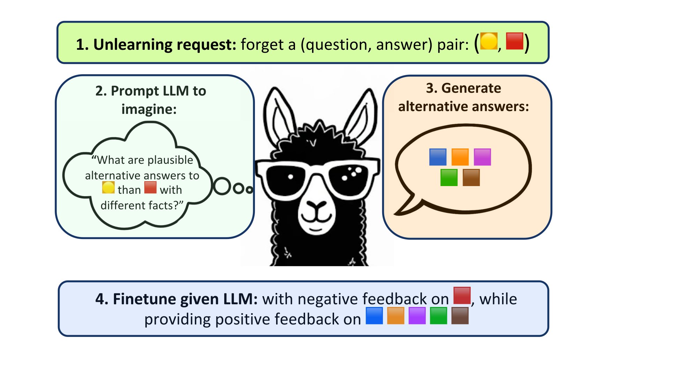

# Alternate Preference Optimization for Unlearning Knowledge

Implementation for [Alternate Preference Optimization for Unlearning Factual Knowledge in Large Language Models", COLING 2025](https://arxiv.org/abs/2409.13474).



In all our experiments, we rely on [TOFU](https://github.com/locuslab/tofu) checkpoints and eval logs (in the `data` folder) in our experiments. For Llama3.2 we train our own models with parameters as mentioned in the paths and configs.


## Installation
```script
conda create -n tofu python=3.12
conda activate tofu
pip install -r requirements.txt
pip install flash-attn --no-build-isolation
```

## Quick Start

### Generate Alternate Dataset

```script
python generate.py dataset_config.dataset_kwargs.name=forget10
python generate.py dataset_config.dataset_kwargs.name=forget05
python generate.py dataset_config.dataset_kwargs.name=forget01
```

### AltPO
```script
python forget.py --config-name=unlearn_llama2.yaml forget_loss=subdpo beta=0.1 retain_wt=1 seed=0 lr=5e-05 num_epochs=2 augment_k=5 batch_size=5
```

### NPO
```script
python forget.py --config-name=unlearn_llama2.yaml forget_loss=npo beta=0.05 retain_wt=2 seed=0 lr=2e-05 num_epochs=10 batch_size=5
```

### IdkDPO
```script
python forget.py --config-name=unlearn_llama2.yaml forget_loss=idkdpo beta=0.1 retain_wt=1 seed=0 lr=2e-05 num_epochs=10 batch_size=5
```

You can find the stored results in `paper_models/<MODEL>/<FORGET_SPLIT>/<METHOD>/<PARAMS>`

## Citing Our Work
If you find our method interesting and benefecial, please cite our work:
```
@article{mekala2024alternate,
  title={Alternate preference optimization for unlearning factual knowledge in large language models},
  author={Mekala, Anmol and Dorna, Vineeth and Dubey, Shreya and Lalwani, Abhishek and Koleczek, David and Rungta, Mukund and Hasan, Sadid and Lobo, Elita},
  journal={arXiv preprint arXiv:2409.13474},
  year={2024}
}
```